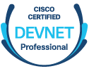
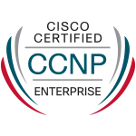
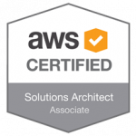

My name is David, a network engineer with a focus on automation and programmability. I have a background in data centre, enterprise and security operations and a keen interest in free and open source software.

I currently hold a CCNP in both Enterprise and DevNet as well as an AWS Solutions Architect Associate certifications.

I am looking to develop my skills specifically in the following areas of data networking, specifically with a focus on DevOps and idempotency to improve repeatability and reliability.

| Discipline   | Technology                  |
| ------------ | --------------------------- |
| Automation   | Ansible, Git, CICD          |
| Cloud Native | Containers, K8s             |
| Data Centre  | ACI, NXOS, UCS              |
| Development  | APIs, 12 Factor App Design  |
| SDN          | ACI, SDWAN, SONiC           |
| Security     | FTD, PANOS                  |

While I have professional certifications within the field, I also have experience building environments across multiple on premise and public cloud platforms.

[Full certification list here at Acclaim](https://www.youracclaim.com/users/david-monaghan.cbe264d1)